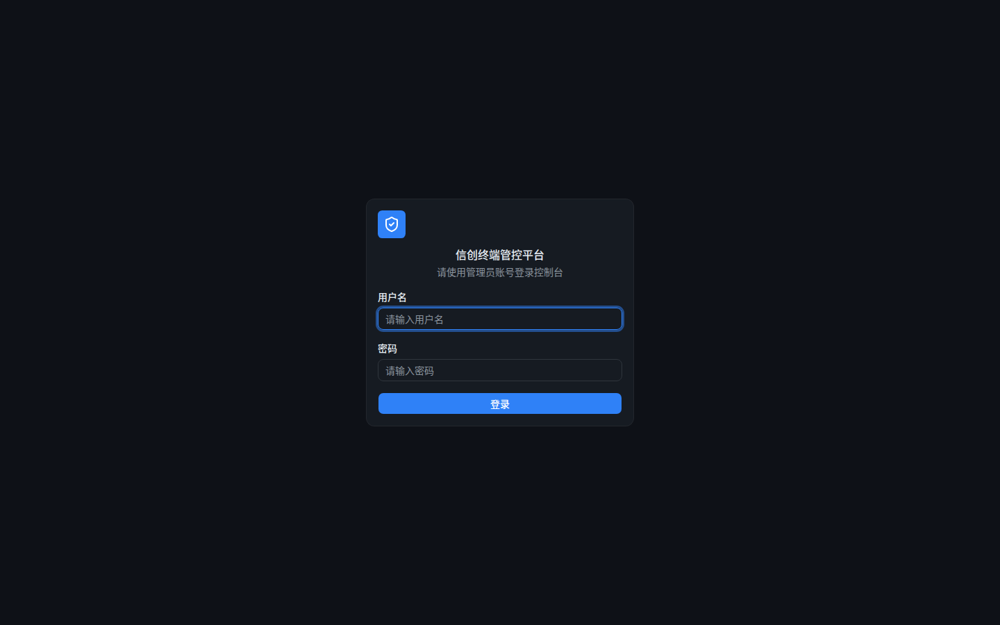
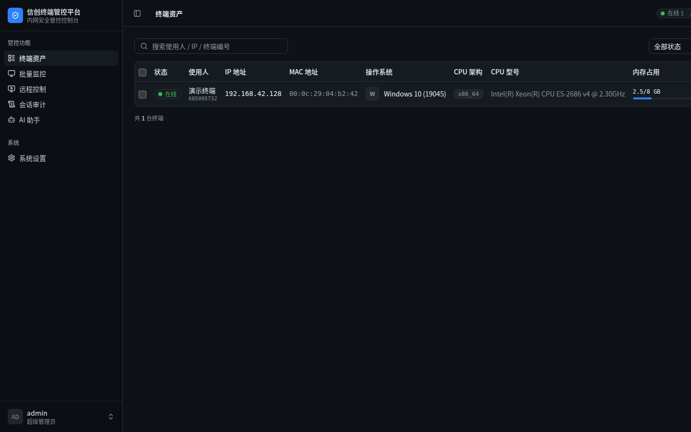
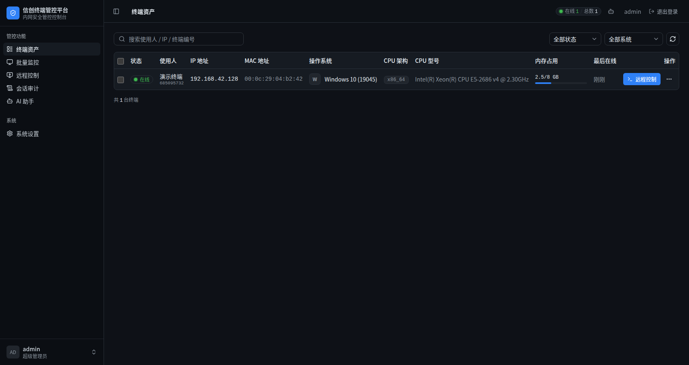
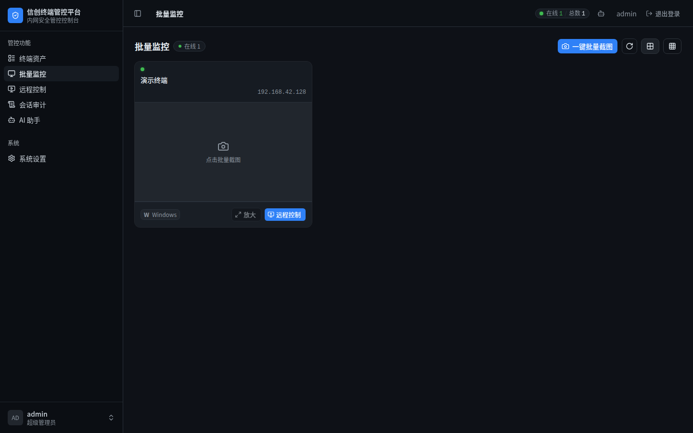
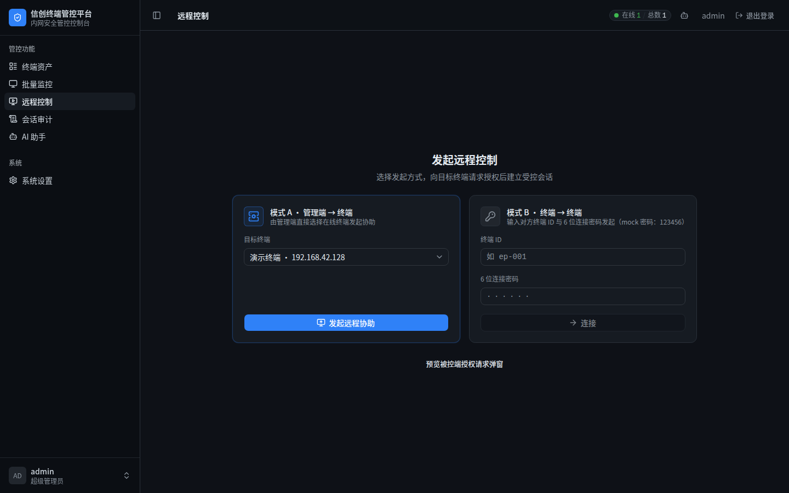
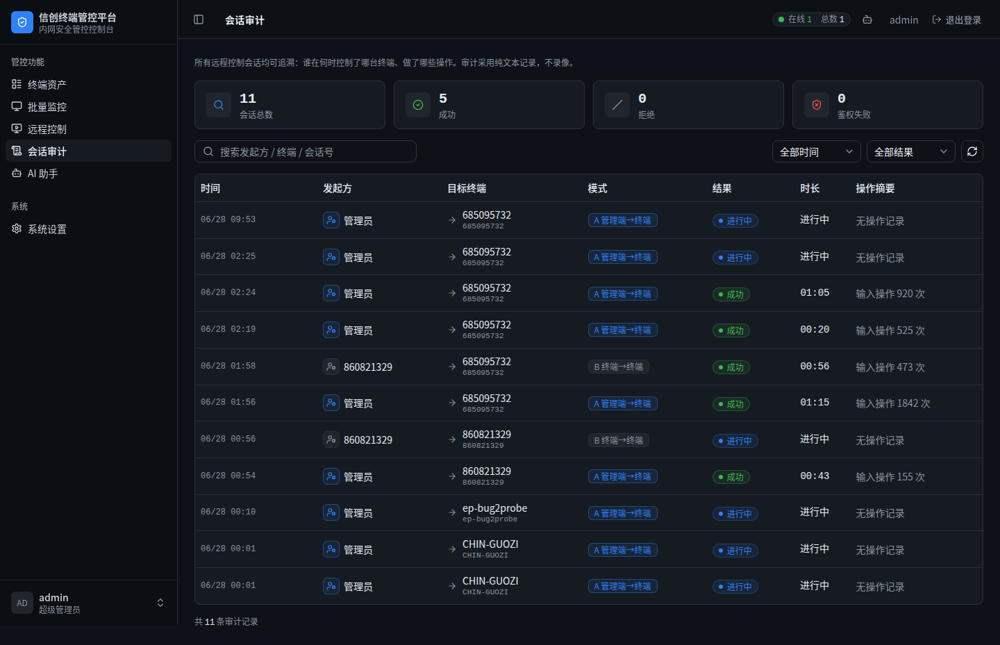
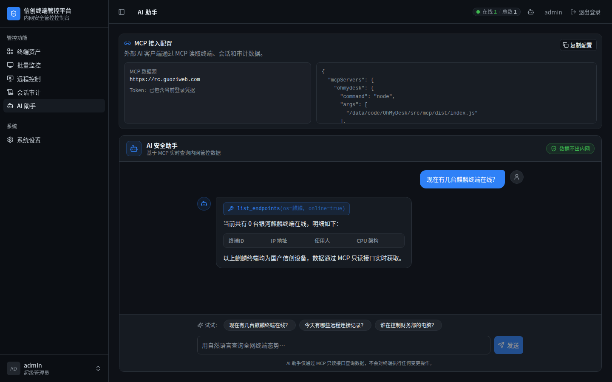

# 用户操作手册

**产品**：OhMyDesk — 信创内网终端远程安全管控平台
**版本**：1.0.0
**访问地址**：https://rc.guoziweb.com（示例部署）
**默认账号**：admin / OhMyDesk@2026（首次部署后在设置页修改）

---

## 第一章：登录系统

### 1.1 打开管理平台

在浏览器地址栏输入服务器地址（如 `http://内网服务器IP:8765/` 或 `https://rc.guoziweb.com`），回车后进入登录页。



### 1.2 填写账号密码

在登录页输入管理员账号和密码：


- **用户名**：admin（或管理员设置的账号）
- **密码**：初始密码 `OhMyDesk@2026`（演示环境为 `infogo@123`）
- 点击「登录」按钮

### 1.3 进入系统

登录成功后自动跳转到终端资产页（/assets）：



左侧导航栏包含五个功能模块：
- **终端资产**：查看所有纳管终端
- **批量监控**：一键全网截图墙
- **远程控制**：发起远程控制会话
- **会话审计**：查看连接和操作记录
- **AI 助手**：自然语言查询管控数据

---

## 第二章：终端资产管理

### 2.1 查看终端列表

点击左侧「终端资产」，进入资产管理页：



**列表说明**：

| 列 | 说明 |
|----|------|
| 设备 ID | 系统分配的唯一标识（ep-xxxx 格式） |
| 使用人/主机名 | Agent 启动时传入的名称 |
| IP 地址 | 终端当前 IP |
| 操作系统 | 自动识别（含信创 OS 图标） |
| CPU 架构 | 自动识别（龙芯/鲲鹏/飞腾/x86 图标） |
| 状态 | 🟢 在线 / ⚫ 离线 |
| 最后在线 | 最近一次心跳时间 |

### 2.2 查看终端硬件详情

点击任一终端行，右侧弹出硬件详情抽屉：

- CPU 型号、架构、核心数
- 内存总量（MB）
- GPU 型号、显存（MB）
- MAC 地址、IP 地址
- OS 版本详细信息

### 2.3 终端 Agent 安装

**Linux/信创终端（推荐 .deb）**：
```bash
sudo dpkg -i ohmydesk-client_*.deb
# 默认连接 wss://rc.guoziweb.com/ws
# 内网部署：编辑 /etc/ohmydesk/client.env 修改 OHMYDESK_SERVER
ohmydesk-client-launch
```

**Windows 终端**：
```
将 dist-windows/ 目录复制到 Windows 机器
双击 连接服务器.bat
```
Agent 启动后自动反连服务器注册，约 5 秒后在终端列表可见。

---

## 第三章：批量监控截图

### 3.1 进入批量监控页

点击左侧「批量监控」：



### 3.2 一键批量截图

点击页面右上角「**一键截图**」按钮：

1. 系统向所有在线终端广播截图指令
2. 各终端 Agent 截取当前屏幕（JPEG 格式）
3. 截图通过 WebSocket 回传服务器，推送到管理端
4. 约 2-5 秒内，网格墙填满所有在线终端的实时截图

**注意**：
- 仅在线终端会响应截图请求；离线终端格子显示「离线」
- WSL 环境下截屏为合成占位帧（含标注），真实信创物理机取真实屏幕

### 3.3 查看截图详情

点击任一截图格，可放大查看：
- 终端名称和 ID
- 截图时间戳
- 全尺寸截图预览

---

## 第四章：远程控制

### 4.1 发起远程控制（模式 A：Web→终端）



**操作步骤**：

1. 在「终端资产」列表中找到目标在线终端
2. 点击该行的「**远程**」按钮
3. **目标终端弹出授权对话框**，等待终端用户点击「接受」
4. 用户接受后，远控窗口显示目标终端实时画面
5. 在画面上移动鼠标、点击、输入键盘内容，操作透传到目标终端

**断开连接**：点击「断开」按钮或关闭远控窗口，双端均收到结束通知。

**注意事项**：
- 若目标用户点击「拒绝」，系统记录拒绝事件并提示管理员
- 画面刷新频率取决于网络质量和终端截屏速度（局域网通常 1-2 FPS）

### 4.2 终端间远控（模式 B：终端→终端）

在客户端 Agent 界面：
1. 输入目标终端的设备 ID（ep-xxxx 格式）
2. 输入目标终端的临时密码（在资产详情页查看）
3. 点击「连接」，目标端同样弹出授权对话框
4. 接受后建立会话，画面流与模式 A 相同

### 4.3 文件传输

在远控会话建立后，点击工具栏的「文件传输」：

- **上传**：从本地选择文件，传输到被控终端
- **下载**：从被控终端选择文件，下载到本地

### 4.4 远程命令执行

在远控会话建立后，点击工具栏的「命令执行」：

1. 在输入框输入 Shell 命令（如 `ls /tmp`）
2. 点击「执行」，命令在被控终端运行
3. 命令输出实时显示在结果区域

---

## 第五章：会话审计

### 5.1 查看审计列表

点击左侧「会话审计」：



**审计内容**：

| 记录类型 | 说明 |
|---------|------|
| 连接记录 | 会话 ID、模式(A/B)、发起方、目标终端、开始/结束时间、时长、结果 |
| 操作记录 | 每个会话内的操作日志：发起截图、鼠标点击坐标、键盘输入类型、断开等 |

### 5.2 筛选审计记录

- **按终端筛选**：在搜索框输入终端 ID 或名称
- **按时间筛选**：选择时间范围（开始日期 ~ 结束日期）
- **按事件类型**：选择 connect / screenshot / input / disconnect 等

### 5.3 审计导出

（功能规划中，当前版本直接查看，可截图导出）

---

## 第六章：AI 助手（MCP 问答）

### 6.1 进入 AI 助手

点击左侧「AI 助手」：



### 6.2 自然语言提问

在对话框输入问题，AI 调用 MCP 工具实时查询管控数据：

**示例问题**：

| 问题 | AI 调用工具 |
|------|------------|
| 现在有几台在线终端？ | list_endpoints（filter: online=true） |
| 列出所有麒麟操作系统终端 | list_endpoints（filter: os_type=kylin） |
| 哪台终端当前正在被远程控制？ | get_active_sessions |
| 查看今天的远程会话记录 | query_audit_log（filter: 今天） |
| 财务部张伟的电脑硬件配置 | get_endpoint_detail |

### 6.3 注意事项

- AI 助手基于 MCP 工具读取实时数据，所有数据在内网流转
- 演示环境使用 Claude API；生产部署可替换为内网私有化大模型
- MCP Server 只有只读权限，不能通过 AI 修改任何配置

---

## 第七章：系统设置

在右上角用户菜单中进入「系统设置」：

- **修改密码**：修改管理员账号和密码（落 SQLite 持久化，重启不丢失）
- **JWT 密钥**：建议生产环境通过 `OHMYDESK_JWT_SECRET` 环境变量设置固定密钥

---

## 附录：常见问题

| 问题 | 解决方法 |
|------|---------|
| 终端注册后不显示 | 检查 Agent 是否成功连接（日志：`连接成功`）；防火墙开放 8765 端口 |
| 批量截图部分终端无截图 | 检查该终端是否在线；WSL 环境设 OHMYDESK_FAKE_CAPTURE=1 |
| 远控画面不刷新 | 检查网络延迟；确认目标终端在 X11 会话（非 Wayland） |
| 登录后 Token 失效 | 服务端重启且未设固定 JWT_SECRET 会导致 Token 失效，重新登录 |
| AI 助手无响应 | 检查 MCP Server 是否运行；确认 OHMYDESK_API_TOKEN 有效 |
